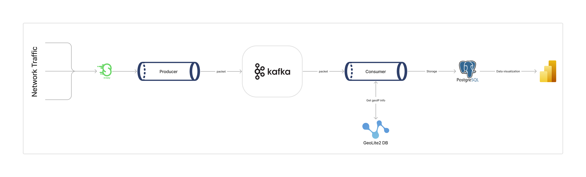

# Network Traffic Analysis and Visualization Data Pipeline

This project focuses on creating a comprehensive data pipeline for capturing, streaming, transforming, storing, and visualizing network traffic data. By leveraging technologies such as Python, Kafka, PostgreSQL, and Power BI, the goal is to provide a seamless solution for analyzing and monitoring network traffic patterns.

## Overview

The project is structured around the following key components:

1. **Data Collection:** Utilizing a Python script, the project captures network traffic data using the `Scapy` library, enabling precise and detailed packet capture.

2. **Data Streaming:** Captured data is streamed to a Kafka topic using a Kafka producer within the Python script. This step acts as a buffer for incoming data, ensuring a continuous flow for analysis.

3. **Data Transformation:** A Kafka consumer consumes data from the Kafka topic, extracting relevant information such as packets, unique hosts, geoip information, etc., and transforms the data as required for further processing.

4. **Data Storage:** Transformed data is stored in a PostgreSQL database. PostgreSQL offers a reliable and scalable solution for storing network traffic data, ensuring data integrity and accessibility.

5. **Data Visualization:** Power BI is used to connect to the PostgreSQL database, enabling the creation of visualizations and dashboards based on calculated traffic metrics. This feature facilitates easy monitoring and analysis of network traffic patterns, aiding in identifying potential issues or anomalies.

## The Pipeline



As mentioned above, the data pipeline consists of several stages, each serving a specific purpose in the overall process. The pipeline starts with data collection, followed by streaming, transformation, storage, and visualization.

This structured approach ensures that network traffic data is efficiently captured, processed, and presented in a meaningful way.

## Getting Started

To begin working with this project, follow these steps:

1. **Clone the Repository:**

   ```sh
   git clone https://github.com/ElhoubeBrahim/network-traffic-analysis.git
   cd network-traffic-analysis
   ```

2. **Install Dependencies:**

   ```sh
   pip install -r requirements.txt
   ```

3. **Run Docker Compose:**

   ```sh
   docker-compose up -d
   ```

   This command starts a Kafka broker and a PostgreSQL database. Additionally, it launches kafka-ui and adminer for monitoring and managing Kafka and PostgreSQL.

4. **Run the Python Scripts:**

   ```sh
   python src/transform.py
   python src/capture.py
   ```

   These commands initiate the process of capturing network traffic data, producing it to the Kafka topic, consuming it, transforming it, and storing it in the PostgreSQL database.

5. **Connect Power BI to PostgreSQL:**

   - Open Power BI and click on `Get Data`.
   - Select `Database` and then choose `PostgreSQL`.
   - Enter the PostgreSQL server details (host, port, database, username, password) and click `Connect`.
   - Choose the tables you want to import and click `Load`.

You can access the report I created in the `assets/report.pdf` file located in the assets directory.

## Acknowledgements

This project utilizes several technologies and tools, including:

- [Scapy](https://scapy.net/) for packet capture.
- [Apache Kafka](https://kafka.apache.org/) for data streaming.
- [PostgreSQL](https://www.postgresql.org/) for data storage.
- [Power BI](https://powerbi.microsoft.com/) for data visualization.
- [GeoLite2](https://dev.maxmind.com/geoip/geoip2/geolite2/) for geolocation data.
- [Docker](https://www.docker.com/) for containerization.
